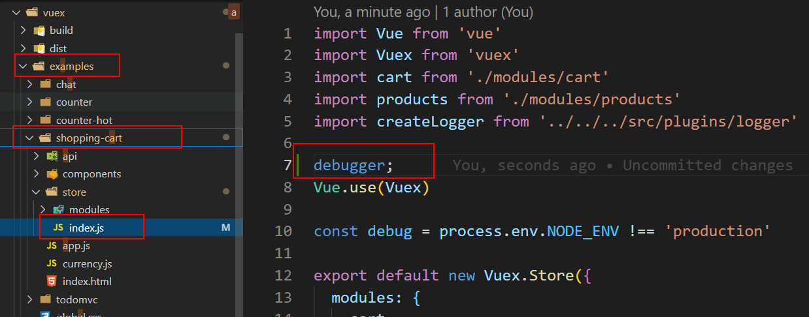

# vuex 源码阅读

当前阅读的 vux 版本 3.1.3。基本源码目录结构：

```
Vuex
├── src                                   源码目录
│   ├── module                            与模块 module 相关的操作
│   │   ├── module-collection.js          用于收集并注册根模块和嵌套模块
│   │   └── module.js                     定义 Module 类，存储模块内的一些信息，例如: state...
│   ├── plugins                           插件
│   │   ├── devtool.js                    用于 devtool 调试
│   │   └── logger.js                     日志
│   ├── helpers.js                        辅助函数，例如：mapState、mapGetters、mapMutations...
│   ├── index.esm.js                      es6 module 打包入口
│   ├── index.js                          入口文件
│   ├── mixin.js                          通过 mixin 将 vuex 全局混入
│   ├── store.js                          定义了 Store 类，核心
│   ├── util.js                           工具函数
```


## 调试方式

1. 将 vuex 源码 clone 下来

2. 修改 `vuex/examples/webpack.config.js`，添加一行代码 `devtool: 'source-map'`

   

3. 在 vuex 根目录执行 `npm install` 装包，后运行 `npm run dev`，打开 `http://localhost:8080`，就可以利用 vuex 的 example 示例进行调试

   

4. 在 examples 里面对应的示例打 debugger 即可，例如这里利用 shopping-cart 示例进行调试

   


